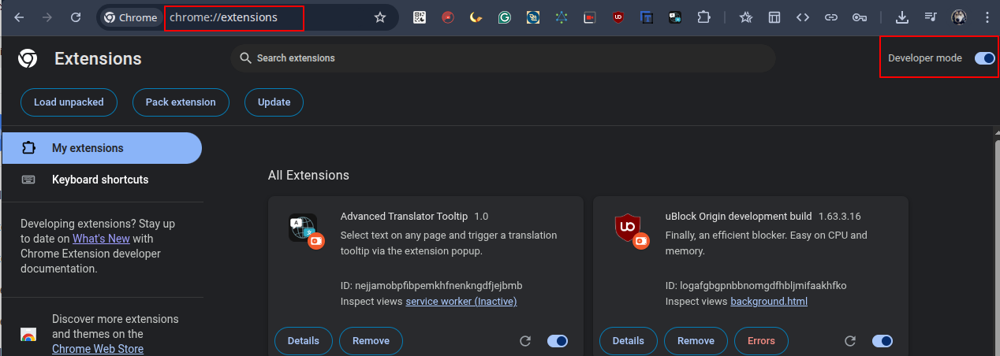
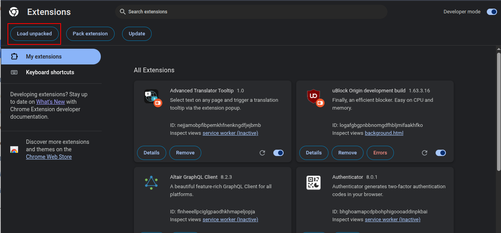
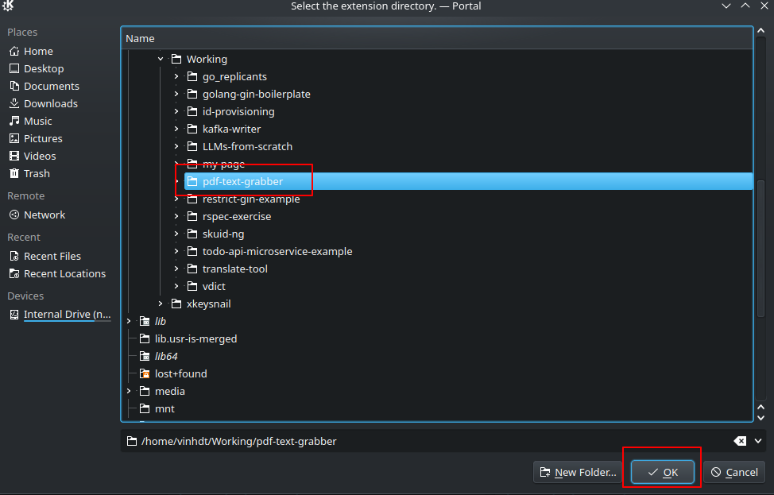
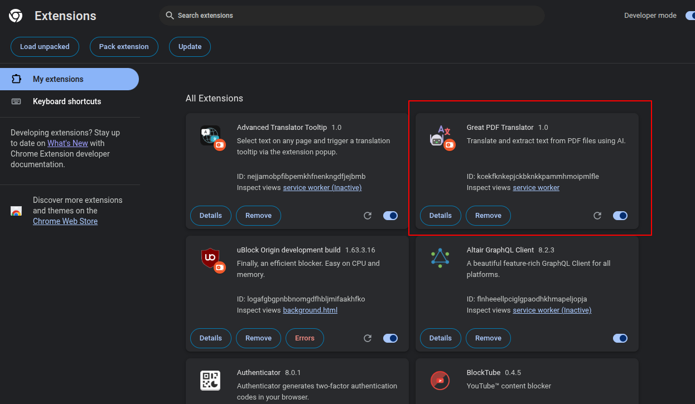
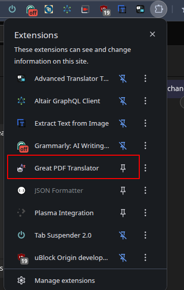
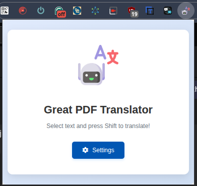
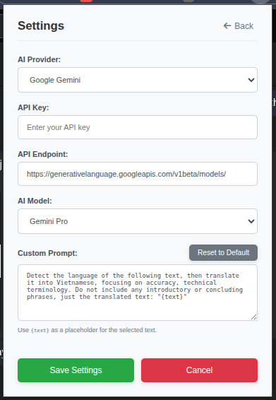
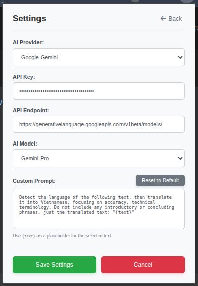
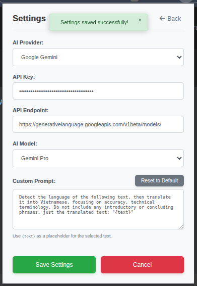
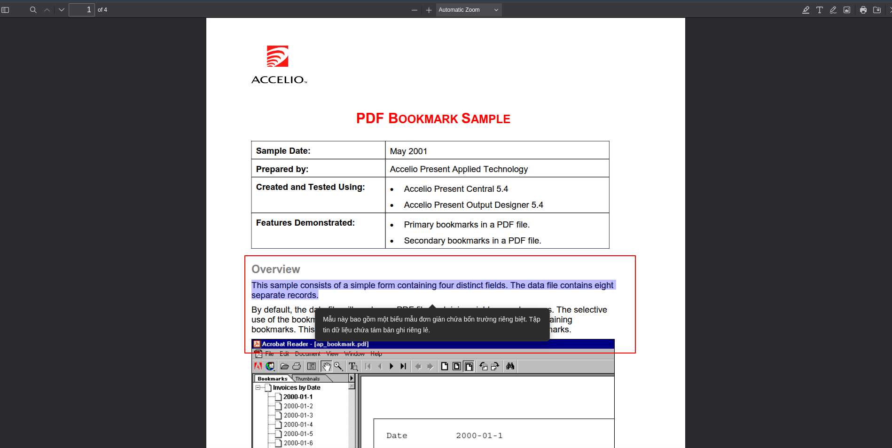

# Great PDF Translator

**An essential Chrome extension that allows you to translate text directly inside any PDF file, without ever leaving your document.**

The Great PDF Translator is a powerful Chrome extension that integrates directly into your Browse experience, providing quick and seamless translations powered by your choice of Google Gemini or OpenAI GPT models.

## The Problem
Tired of the slow, multi-step process of translating PDF text? Highlighting text, copying it (Ctrl+C), switching tabs to Google Translate, pasting, and then switching back breaks your focus and wastes valuable time.

## The Solution
* **Great PDF Translator** transforms this frustrating workflow. It seamlessly integrates a powerful translator directly into your browser's PDF viewer.
* **Instant, In-Page Translation**: Simply select text and right-click to translate it instantly.
* **Stay Focused**: The translation appears in a clean popup right on top of your document. No more switching tabs.
* **Works Everywhere**: Handles both online PDFs and local PDF files from your computer.

This is the perfect tool for anyone who reads documents in multiple languages—students, researchers, legal professionals, and global teams.

## Features

* **Intuitive UI:** A small, non-intrusive translate icon appears next to your selection. Click it, or use the Shift key for quick translation.
* **Customizable AI Provider:** Choose between Google Gemini and OpenAI GPT.
* **Flexible Model Selection:** Select specific AI models available from your chosen provider.
* **Configurable API Endpoint:** Use default API endpoints or specify your own.
* **Personalized Prompt:** Define your own translation prompt to tailor the output (e.g., "Translate to French:", "Summarize and translate to Spanish:").
* **Real-time Feedback:** Visual loading animation and clear toast messages for success or error.

## Installation Guide (Load Unpacked Extension)

Since your extension is currently in development, you'll install it as an "unpacked" extension in Chrome.

1.  **Download/Clone the Extension:**
    * If you received a `.zip` file of the extension, extract its contents to a folder on your computer (e.g., `C:\pdf-translater-extension` or `~/pdf-translater-extension`).
    * If you cloned from a repository, navigate to the directory where you cloned the project.

2.  **Open Chrome Extensions Page:**
    * Open your Google Chrome browser.
    * Type `chrome://extensions` into the address bar and press Enter.

3.  **Enable Developer Mode:**
    * On the Extensions page, locate the "Developer mode" toggle switch in the top right corner.
    * Click the toggle to turn it **ON**.
      

4.  **Load Unpacked Extension:**
    * Once Developer mode is enabled, three new buttons will appear at the top. Click the "Load unpacked" button.
    

5.  **Select Extension Folder:**
    * A file dialog will open. Navigate to the folder where you extracted or cloned your extension (the folder containing `manifest.json`, `background.js`, etc.).
    * Select this entire folder and click "Select Folder" (or "Open" depending on your OS).
    

6.  **Extension Installed:**
    * Your "Great PDF Translator" extension should now appear on the Extensions page.
    

    * You might want to "pin" the extension to your Chrome toolbar for easy access. Click the puzzle piece icon in your Chrome toolbar, find your extension, and click the pin icon next to it.
    

## Configuration Guide (Settings)

Before first use, or to customize its behavior, you'll need to configure your API settings.

1.  **Open Extension Popup:**
    * Click the "Great PDF Translator" icon in your Chrome toolbar (the one you just pinned). This will open the extension's popup.
    

2.  **Navigate to Settings:**
    * On the main popup screen (Splash Screen), click the "Settings" button (gear icon).
    

3.  **Configure API Settings:**
    * **AI Provider:** Select your desired AI service (e.g., "Google Gemini" or "OpenAI GPT") from the dropdown.
    * **API Key:** Enter your valid API Key for the selected provider. This is crucial for the extension to work.
        * **For Google Gemini:** Obtain your API key from the [Google AI Studio](https://aistudio.google.com/app/apikey).
        * **For OpenAI GPT:** Obtain your API key from the [OpenAI API keys page](https://platform.openai.com/account/api-keys).
    * **API Endpoint:** The default endpoint for your chosen provider will be pre-filled. You generally don't need to change this unless you're using a custom proxy or specific regional endpoint.
    * **AI Model:** Choose a specific AI model from the dropdown. The available models will update based on your selected AI Provider.
    * **Custom Prompt:** (Optional) Customize the prompt sent to the AI model. Use `{text}` as a placeholder for the selected text that will be translated.
        * *Example:* `Translate this scientific text into simplified Chinese: '{text}'`
        * Click "Reset to Default" to revert to the standard translation prompt.

    

4.  **Save Settings:**
    * After making your desired changes, click the "Save Settings" button.
    * A "Settings saved successfully!" toast message will appear at the top if successful. If there are issues, an error toast will appear.

    

5.  **Go Back to Splash Screen:**
    * Click the "Back" button to return to the main splash screen.

## Usage Guide

Once configured, using the Great PDF Translator is straightforward!
How to Use

1. Open any PDF in your Chrome browser. The extension will automatically open it in the enhanced viewer.
2. Select text with your mouse.
3. Press Shift or click to the app icon to translate
4. A popup will appear instantly with the translated text.

## Troubleshooting

* **"API Key is not set..." error:** Go to the extension settings and ensure your API Key is correctly entered.
* **"An unknown error occurred during translation." or network errors:**
    * Check your internet connection.
    * Verify your API Key is correct and has the necessary permissions.
    * Ensure your selected API Endpoint is correct and accessible.
    * Check the developer console (`F12` -> `Console` tab) for more specific error messages from the extension.
* **Icon not appearing / extension breaking:** Reload the extension on `chrome://extensions/`. If the problem persists, try reinstalling it.
* **Translation is not what I expect:** Adjust your "Custom Prompt" in the settings to guide the AI model more effectively.

---

**Thank you for using Great PDF Translator!**
